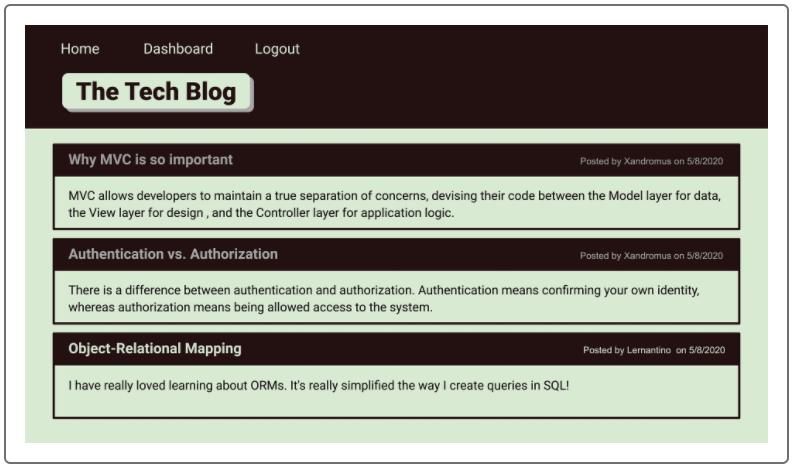

# tech-blog-mvc-esxpress-handlebars-mysql2-dotenv-sequelize

## Description

A CMS-style blog site about tech. Can publish articles, blog posts, and thoughts and opinions

## Table of Contents

- [Installation](#installation)
- [Technologies Used](#technologies)
- [Link](#Link)
- [License](#license)

## Installation

- Create and download a repository

- Create a git repo and open the containing folder

- Open VS Code

  - Create a .gitignore file and iput node_modules/ and .DS_Store/
  - Create a dotenv file

- In the VS Code terminal, run npm init -y (to answer all queries) to create package_json

- Install the following dependencies:

  - npm express
  - npm install express-handlebars
  - npm install mysql2
  - npm install sequelize
  - npm install dotenv
  - npm install bcrypt
  - npm install express-sessiongit
  - npm install connect-session-sequelize

- 'npm start' or 'node server.js' in the command line

## Technologies

- MySql2
- JavaScript
- Node
- Express, express-handlebars, express-session,connect-session-sequelize
- Bcrypt
- Dotenv
- Heroku

### Application Screenshot

  

## Link

[GitHub Link](https://github.com/Okingiboy/tech-blog-mvc-esxpress-handlebars-mysql2-dotenv-sequelize)

[Heroku Link](https://dashboard.heroku.com/pipelines/e9ff3119-4da1-42b6-a980-5e7c1dc0b958)

## License

